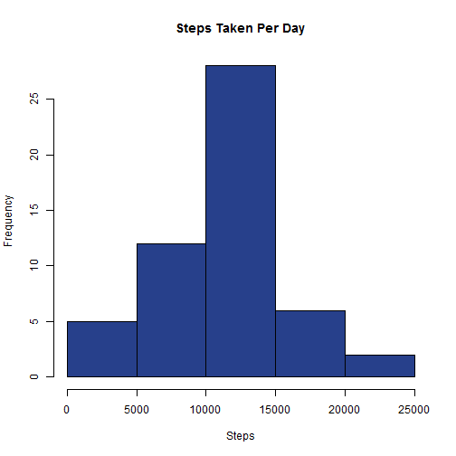
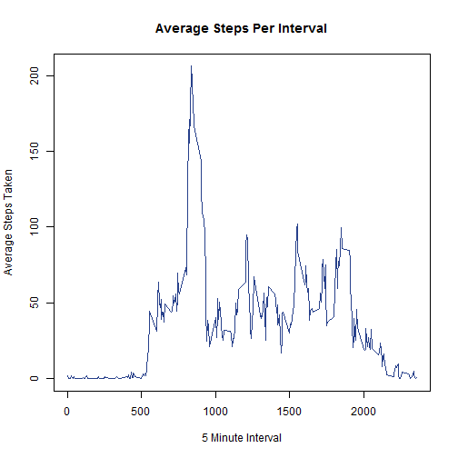

# Reproducible Research: Peer Assessment 1

## Loading and preprocessing the data

```r
     library(lattice)
     setwd("C:/THARRIS/Coursera/Reproducible Data")
     
     ## Unpack and load our data set
     if(!file.exists("./data")){dir.create("./data")}
     if(!file.exists("./data/activity.csv")){
          unzip("./activity.zip",exdir = "./data")}
     activityData <- read.csv("./data/activity.csv")
     
     ## Tidy/transform our data so that its more suitable for analysis
     date <- strptime(activityData$date, format = "%Y-%m-%d")
     date <- format(date, "%Y/%m/%d")
     activityData$date <- date
     activityData <- cbind(activityData[,2:3],activityData$steps)  ## Reorder variables
     names(activityData) <- c("date","interval","steps")
```

## After removing rows with missing data, what is mean total number of steps taken per day?

### Create a historgram showing mean steps per day:

```r
     activityDataNoNAs <- na.omit(activityData)
     totalStepsPerDay <- aggregate(activityDataNoNAs$steps, by=list(date = activityDataNoNAs$date), FUN=sum)
     hist(totalStepsPerDay$x, right = FALSE, col="royalblue4", main = "Steps Taken Per Day", xlab = "Steps")
```



### Mean steps per day

```r
     meanStepsPerDay <- mean(totalStepsPerDay$x)
     print(meanStepsPerDay)
```

```
## [1] 10766.19
```

### Median steps per day

```r
     medianStepsPerDay <- median(totalStepsPerDay$x)
     print(meanStepsPerDay)
```

```
## [1] 10766.19
```

## After removing rows with missing data, what is the average daily activity pattern?

### Create a plot showing mean steps per interval:

```r
     averageStepsPerInterval <- aggregate(activityDataNoNAs$steps, by=list(interval = activityDataNoNAs$interval), FUN=mean)
     names(averageStepsPerInterval) <- c("interval","meanSteps")
     plot(averageStepsPerInterval$interval,averageStepsPerInterval$meanSteps, type ="l", col="royalblue4",
          main = "Average Steps Per Interval", xlab = "5 Minute Interval", ylab = "Average Steps Taken")
```



### Interval with the highest average steps

```r
     averageStepsPerInterval <- averageStepsPerInterval[with(averageStepsPerInterval, order(-meanSteps)),]
     intervalMax <- averageStepsPerInterval[1,1]
     print(intervalMax)
```

```
## [1] 835
```

## Imputing missing values

### Total observations missing steps (value = NA)

```r
     totalMissingValues <- nrow(activityData) - sum(complete.cases(activityData$steps))
     print(totalMissingValues)
```

```
## [1] 2304
```

### Create a historgram showing mean steps per day, after NAs were populated using interval means:

```r
     activityDataFixed <- activityData
     i <- 1
     for (i in 1:nrow(activityDataFixed))
     {
          if(is.na(activityDataFixed[i,3]))
          {
               targetValue <- paste0(paste0("^",activityDataFixed[i,2]),"$")
               targetRowNumber <- which(grepl(targetValue,averageStepsPerInterval$interval))
               activityDataFixed[i,3] <- averageStepsPerInterval[targetRowNumber,2]
          }
     }
     totalStepsPerDayFixed <- aggregate(activityDataFixed$steps, by=list(date = activityDataFixed$date), FUN=sum)
     
     hist(totalStepsPerDayFixed$x, right = FALSE, col="royalblue4",  xlab = "Total Steps Taken",
          main = "Average Total Steps Per Day\nNAs populated using interval means")
```


### Mean steps per day

```r
     meanStepsPerDayFixed <- mean(totalStepsPerDayFixed$x)
     print(meanStepsPerDayFixed)
```

```
## [1] 10766.19
```

### Median steps per day

```r
     medianStepsPerDayFixed <- median(totalStepsPerDayFixed$x)
     print(medianStepsPerDayFixed)
```

```
## [1] 10766.19
```

Note that after fixing the rows with missing values (populating NAs with interval averages), the mean did not change, but the median did (median now equals mean).

## Are there differences in activity patterns between weekdays and weekends?

### Create a plot showing mean steps per interval, comparring weekend behavior vs weekday:

```r
     ##Create a new variable showing weekday vs weekend
     weekendDays <- c("Saturday","Sunday")
     activityWeekday <- as.factor(weekdays(as.Date(activityDataFixed[,1],format = "%Y/%m/%d"))) ## Creates a vector of weekdays
     weekend <- activityWeekday %in% weekendDays  ## TRUE if the weekday was Saturday or Sunday
     weekend <- replace(weekend, weekend==TRUE, "Weekend")  ##Replaces TRUE/FALSE with "Weekend"/"Weekday"
     weekend <- replace(weekend, weekend==FALSE, "Weekday")
     activityDataFixed <- cbind(activityDataFixed,weekend)
     
     ##Create a tidy data set that is easy to plot
     ##NOTE!  There's surely a more efficient way to create this tidy data set, but I'm pressed for time...
     weekendSubset <- activityDataFixed[activityDataFixed$weekend == "Weekend",]
     weekdaySubset <- activityDataFixed[activityDataFixed$weekend == "Weekday",]
     totalStepsPerWeekendFixed <- aggregate(weekendSubset$steps, by=list(interval = weekendSubset$interval), FUN=mean)
     totalStepsPerWeekdayFixed <- aggregate(weekdaySubset$steps, by=list(interval = weekdaySubset$interval), FUN=mean)
     totalStepsPerWeekendFixed <- cbind(totalStepsPerWeekendFixed,rep(c("Weekend"),each=nrow(totalStepsPerWeekendFixed)))
     totalStepsPerWeekdayFixed <- cbind(totalStepsPerWeekdayFixed,rep(c("Weekday"),each=nrow(totalStepsPerWeekdayFixed)))
     names(totalStepsPerWeekendFixed) <- c("interval","steps","weekend")
     names(totalStepsPerWeekdayFixed) <- c("interval","steps","weekend")
     tidyWeekendComparrisonSet <- rbind(totalStepsPerWeekendFixed,totalStepsPerWeekdayFixed)
     
     xyplot(steps ~ interval | weekend, data = tidyWeekendComparrisonSet, layout = c(1,2),
            type = "l", xlab = "Interval", ylab = "Number of steps")
```


From this plot, one might conclude that the subject is generally more active during the weekends, but has a slower start during the mornings.
